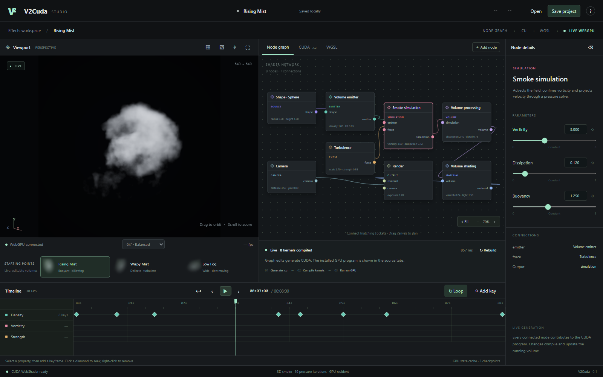

# V2Cuda

[](https://github.com/SamG-Coder/V2Cuda/actions/workflows/ci.yml)
[](LICENSE)

A live node-based CUDA WebShader studio for 3D smoke and mist. The running application is the deliverable: editing a connected node regenerates CUDA, compiles the relevant GPU program and updates the viewport. There is no export step between editing and seeing the shader run.



## Start

Requires Node.js 20+ and a WebGPU-capable browser with hardware acceleration.

```powershell
git clone https://github.com/SamG-Coder/V2Cuda.git
cd V2Cuda
npm install
npm start
```

Open **http://localhost:5198**. `START.bat` also starts the local server. The compiler and runtime are vendored; the app needs no cloud service, API key, remote assets or CUDA Toolkit. The server binds only to the local machine.

## What runs

The connected graph produces a single CUDA translation unit. The WebShader compiler lowers eight entry points into WGSL. JavaScript manages the editor, compilation worker, GPU resources, dispatch ordering and buffer-to-canvas presentation. Density, velocity, forces, pressure projection, animation evaluation, lighting and pixel shading run in generated CUDA kernels.

The simulation is a bounded 3D Eulerian smoke solver:

- Semi-Lagrangian advection of velocity and density.
- Animated density and momentum injection through ellipsoidal emitter shapes.
- Noise forces, buoyancy, curl calculation and vorticity confinement.
- Jacobi pressure iterations followed by velocity projection.
- Softened boundaries with density dissipation near the domain edge.
- Perspective volume ray marching, trilinear field sampling, three light-path density samples, Beer–Lambert absorption and exposure mapping.
- Procedural subvoxel erosion and displacement in the renderer to recover finer visible structure than the simulation grid alone provides. This detail is separate from the resolved fluid state and is adjustable.

Grid choices are 48³, 64³, 96³ and 128³, with 12, 16, 24 and 32 pressure iterations respectively. Simulation uses a fixed 1/30 second step and an eight-second timeline. When the GPU cannot sustain playback speed, simulation time advances more slowly rather than using unstable large timesteps. The default preview is 640 × 640.

## Editor workflow

- **Nodes:** select a node to edit its parameters. Drag its title to reposition it. Drag empty graph space to pan, scroll to zoom, or use Fit.
- **Connections:** click an output socket, then a matching input. Right-click an input or wire to disconnect. Socket types and graph cycles are checked. Only nodes that reach Render affect the generated program.
- **Layered effects:** add Shape blend to combine two shapes, or Force blend to combine differently configured Turbulence nodes. Blends can be nested. The solver has one combined emitter input and one combined force input.
- **Live code:** CUDA shows the generated source; WGSL shows each installed kernel. Compilation happens in a worker. A complete, successful kernel set replaces the previous set atomically. Invalid connections or failed compilation preserve the last valid running shader and show diagnostics.
- **Simulation edits:** changes to shapes, emitters, forces or solver parameters invalidate snapshots and replay to the current time. Material, volume processing and camera changes preserve the fluid state.
- **Animation:** pause, select a property, set a value and click its diamond or Add key. Keyframe curves use linear interpolation, clamped at the first and last key. Editing an already animated property inserts or updates a key at the current frame. Click a timeline diamond to seek; right-click it to remove. Animated parameter functions are compiled into CUDA.
- **Timeline:** scrub to a frame, step forward/backward, play/pause or restart. Backward seeks restore a GPU checkpoint or replay from frame zero. A checkpoint is retained each second; the replay is deterministic on the same adapter and program.
- **Camera:** drag the viewport to orbit and scroll to zoom. These inspection offsets do not alter saved camera curves. Reset restores the inspection view. Camera node parameters can be animated.
- **Projects:** Open/Save project stores graph topology, node positions, parameters and animation in `.v2cuda.json`. The current graph is also autosaved in browser local storage. Incomplete graphs can be saved and reopened for further editing. Preview resolution, quality and inspection orbit are session settings.
- **Undo:** Ctrl Z / Ctrl Shift Z, or the toolbar buttons. Ctrl S saves a project, Space toggles playback, Delete removes the selected node and F fits the graph.

The viewport also has composition guides, a checkerboard alpha preview and fullscreen mode. Rising Mist, Wispy Mist and Low Fog are editable starting points. Loop playback restarts the timeline; it is **not a seamless fluid loop**.

## CUDA and host dispatch contract

`src/generator.js` resolves the typed graph and compiles parameter curves and independently connected shape/force expressions. `src/solver-source.js` contains the CUDA solver and renderer template. `src/engine.js` contains the host dispatch contract and GPU checkpoint management.

```powershell
npm run build
```

This generates an inspectable default `generated/rising-mist.cu` plus `.json` artifacts and `.wgsl` files for all eight kernels. Live edits are generated in browser memory and shown in the CUDA tab; they do not silently overwrite that default on disk. Generated WGSL is compiler output and should never be hand-edited.

Each cell is one `float4`: velocity XYZ in cells/second and density W. Two field buffers ping-pong. A third float4 buffer stores curl XYZ and its magnitude. Pressure and divergence are scalar floats per cell. The simulation domain spans approximately [-2, 2] world units on each axis.

| Entry            | Dispatch                             | Purpose                                               |
| ---------------- | ------------------------------------ | ----------------------------------------------------- |
| `clear_field`    | ceil(n³ / 64), 1, 1                  | Reset field and pressure                              |
| `advect`         | ceil(n³ / 64), 1, 1                  | Trace back and sample density/velocity                |
| `compute_curl`   | ceil(n³ / 64), 1, 1                  | Calculate curl and curl magnitude                     |
| `apply_forces`   | ceil(n³ / 64), 1, 1                  | Vorticity, turbulence, buoyancy and emission          |
| `divergence`     | ceil(n³ / 64), 1, 1                  | Calculate divergence and clear pressure               |
| `pressure_solve` | ceil(n³ / 64), 1, 1                  | Jacobi pressure iteration, ping-pong pressure buffers |
| `project`        | ceil(n³ / 64), 1, 1                  | Subtract pressure gradient                            |
| `mist_render`    | ceil(width / 8), ceil(height / 8), 1 | Ray march the field to packed RGBA/BGRA pixels        |

Simulation blocks are 64 × 1 × 1; rendering blocks are 8 × 8 × 1. Dispatch dimensions are workgroup counts. The render output is a uint32 per pixel, copied directly to the WebGPU canvas. The 640-pixel row width satisfies WebGPU's 256-byte copy alignment. There is no per-frame CPU field or pixel readback in normal playback.

## Verification

```powershell
npm test
npm run build
# With npm start running in another terminal:
npm run test:browser
```

The browser suite uses installed Microsoft Edge through Playwright and requires WebGPU. It validates visible smoke, finite GPU state, rewind/replay determinism, divergence reduction against an independent velocity fixture, live parameter edits, source inspection, keyframes, error recovery, node management, project round-tripping, quality changes and responsive layouts. Results are written to `reports/browser-validation.json`, with screenshots alongside it. The browser tests run a real GPU pipeline; a compiler success alone is not treated as rendering evidence.

## Scope

This is an original reference-inspired smoke authoring tool, not a reproduction of the reference application's internal shader or its complete feature set. It does not implement particle simulation, temperature/fire, mesh collision, VDB import/export, arbitrary editable CUDA, native CUDA/OptiX execution or seamless fluid-loop synthesis. The pressure solve is approximate; first-order advection introduces numerical diffusion. Cross-adapter bitwise equality is not promised. Narrow layout is browser-tested, not physical-phone performance-tested.

The CUDA WebShader compiler/runtime are vendored from `SamG-Coder/cuda-webshader`, revision `d6b9de81a68c1ced62144d325fdc701dd368b6ea`. Their MIT license and provenance are under `vendor/cuda-webshader`.
